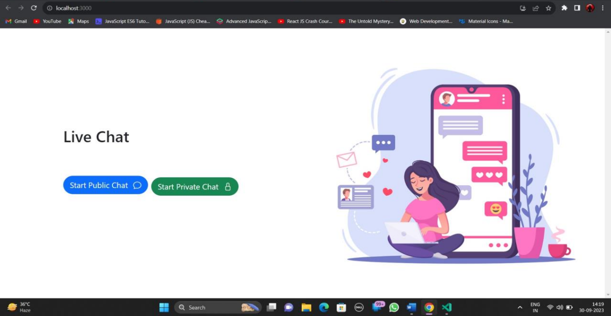
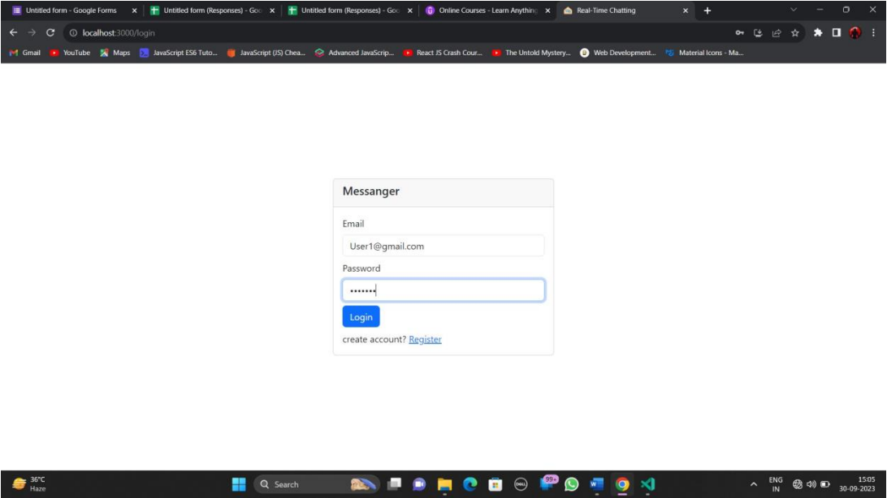
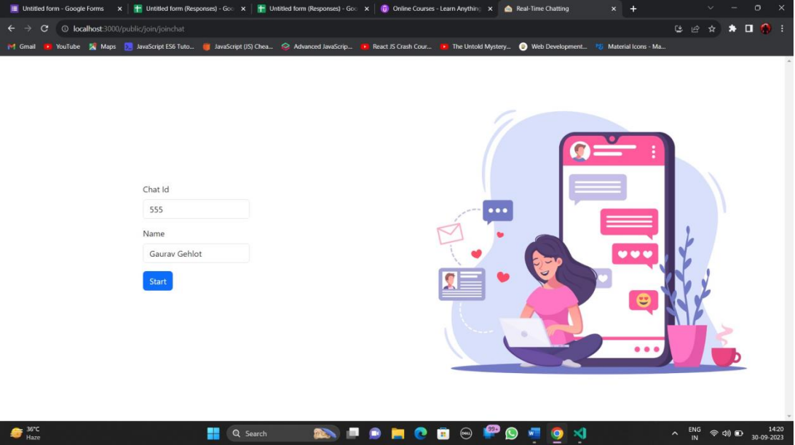
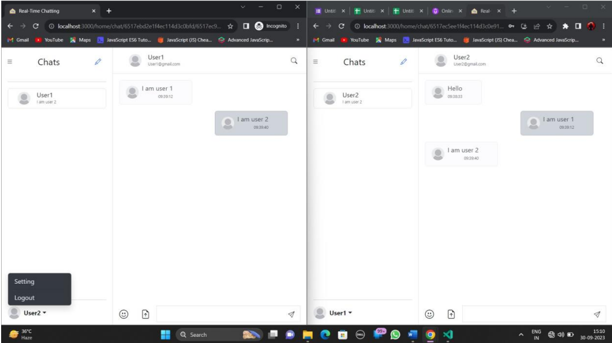

# Real-Time-Chat

A real-time chat web application built with the MERN stack (MongoDB, Express.js, React, Node.js) can serve various needs and purposes in today's digital landscape.

#### How To Use

From your command line, clone and run Project :

```

# Start Frontend
cd frontend-Reactjs

# Install dependencies
npm install

# Start a local dev server
npm start

# Same as for Backend

# Start Frontend
cd frontend-Reactjs

# Install dependencies
npm install

# Start a local dev server
npm start

```

### Images

#### Home Page



#### Login Page



#### Public Chat Page



#### User Chat Page



### Key Features

Real-time chat web applications in Node.js offer a range of key features to facilitate instant
communication and collaboration. Below are some essential features commonly found in such
applications

1. **Real-Time Messaging :**
   The core feature of a chat application is the ability to send and
   receive messages in real-time. Messages should be delivered instantly to all participants
   in the conversation.

2. **Public Chats:** Users should have the option to create or join public chats, enabling
   multiple people to participate in the same conversation simultaneously.

3. **Private Chats:** In addition to group chats, users should be able to initiate private one-on-one conversations for more personalized interactions.

### Objectives

The objectives of a real-time web application in Node.js are to create a dynamic and interactive
online experience for users by leveraging the capabilities of Node.js, which excels at handling
asynchronous and real-time communication. Here are the primary objectives:

1. **Real-Time Interaction:** Enable users to engage in instant, real-time communication
   through features like chat, notifications, updates, and collaborative tools. Users should
   experience minimal delays in receiving and responding to information.

2. **Cross-Platform Compatibility:** Ensure that the application works seamlessly across
   various devices and browsers. Users should have a consistent experience on desktops,
   tablets, and mobile device

### Functional Requirements:

- User Registration:
  - Users can create accounts.
  - Users can log in securely.
- Real-Time Messaging:
  - Users can send and receive text messages in real-time.
  - Messages are delivered instantly to all participants in a conversation.
  - Private one-on-one messaging is supported.
  - Users can create and join group chats.
- Cross-Platform Compatibility:
  - The application works seamlessly across devices and browsers.

```

```
